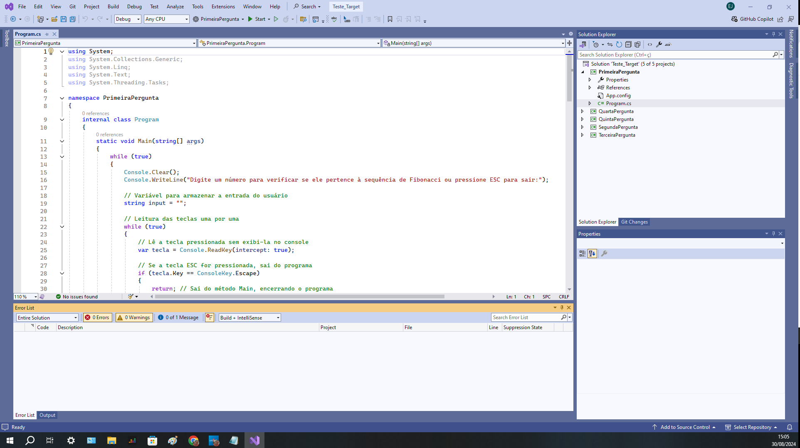

# Estágio - São Paulo

Este documento contém o teste técnico proposto para a etapa de estágio. O objetivo é avaliar suas habilidades técnicas através de uma série de exercícios. Abaixo estão os detalhes da primeira questão proposta.

## Questão 1: Cálculo da Soma

**Descrição:**
Observe o trecho de código abaixo e determine o valor final da variável `SOMA`.
int INDICE = 13, SOMA = 0, K = 0;
while (K < INDICE)
{
    K = K + 1;
    SOMA = SOMA + K;
}
printf("%d", SOMA);

## Questão 2: Sequência de Fibonacci

**Descrição:**
Dada a sequência de Fibonacci, onde se inicia por 0 e 1 e o próximo valor sempre será a soma dos 2 valores anteriores (exemplo: 0, 1, 1, 2, 3, 5, 8, 13, 21, 34...), escreva um programa na linguagem de sua escolha onde, informado um número, ele calcule a sequência de Fibonacci e retorne uma mensagem avisando se o número informado pertence ou não à sequência.
**Objetivo:**
- Implementar a lógica para gerar a sequência de Fibonacci.
- Verificar a presença de um número específico na sequência.
**Nota:**
Esse número pode ser informado através de qualquer entrada de sua preferência ou pode ser previamente definido no código.

## Questão 3: Análise de Faturamento

**Descrição:**
Dado um vetor que guarda o valor de faturamento diário de uma distribuidora, faça um programa, na linguagem de sua escolha, que calcule e retorne:
- O menor valor de faturamento ocorrido em um dia do mês;
- O maior valor de faturamento ocorrido em um dia do mês;
- Número de dias no mês em que o valor de faturamento diário foi superior à média mensal.
**Objetivo:**
- Calcular o menor e o maior valor de faturamento.
- Determinar o número de dias com faturamento acima da média mensal.
**Nota:**
a) Usar o JSON ou XML disponível como fonte dos dados do faturamento mensal;
b) Podem existir dias sem faturamento, como nos finais de semana e feriados. Estes dias devem ser ignorados no cálculo da média.

## Questão 4: Percentual de Representação por Estado

**Descrição:**
Dado o valor de faturamento mensal de uma distribuidora, detalhado por estado:
- SP – R$67.836,43
- RJ – R$36.678,66
- MG – R$29.229,88
- ES – R$27.165,48
- Outros – R$19.849,53

Escreva um programa na linguagem de sua escolha onde calcule o percentual de representação que cada estado teve dentro do valor total mensal da distribuidora.
**Objetivo:**
- Calcular o percentual de representação de cada estado no faturamento total mensal.

## Questão 5: Inversão de String

**Descrição:**
Escreva um programa que inverta os caracteres de uma string.
**Objetivo:**
- Implementar a lógica para inverter os caracteres de uma string.

### Ferramenta utilizada
. IDE - Visual Studio 2022,
. C#

 
<h1 align="center">
    
</h1>
